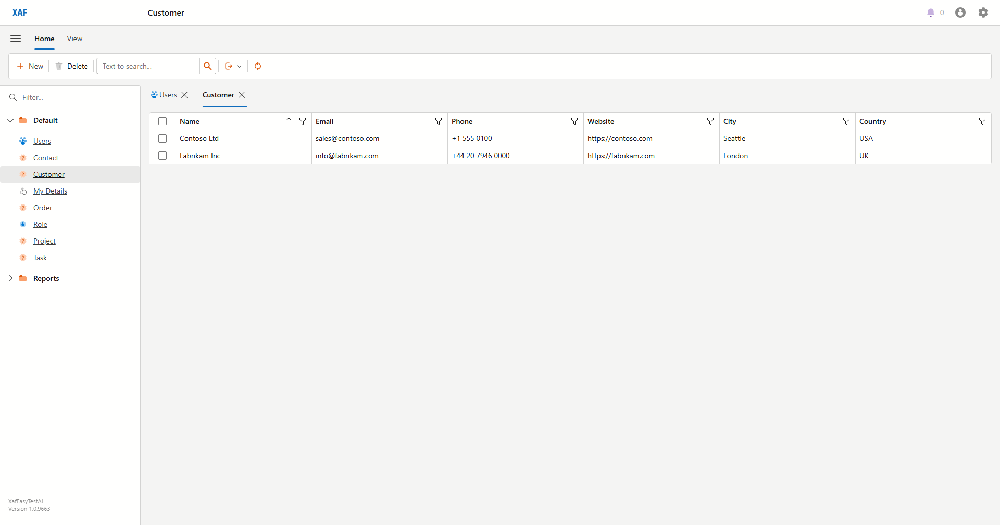
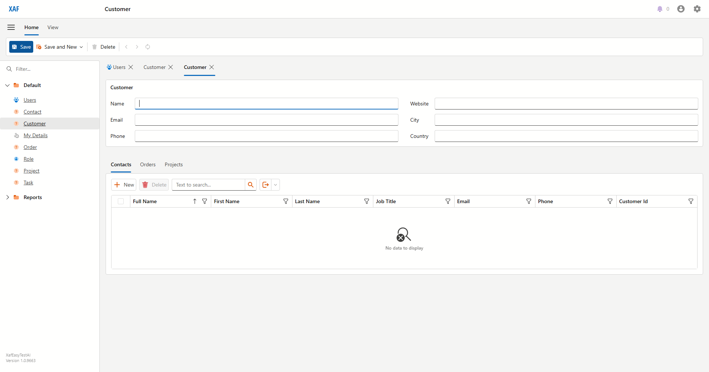
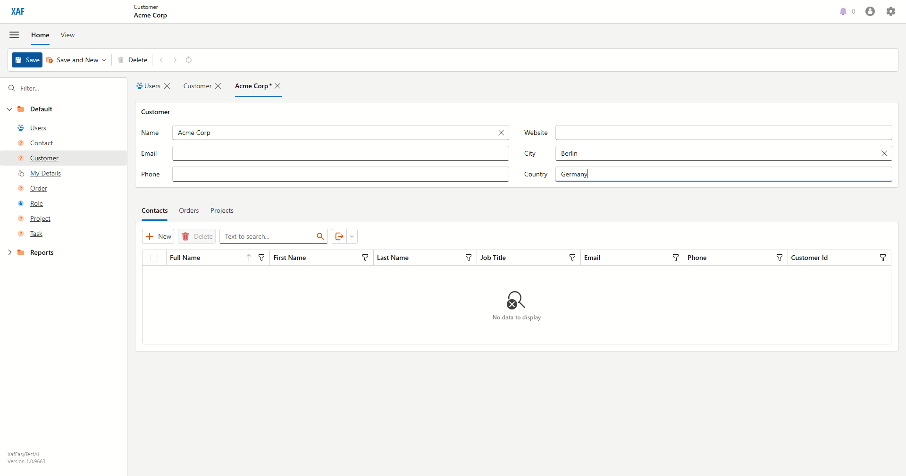
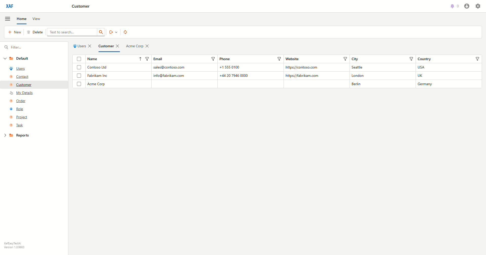

# Managing Customers
_Draft — generated from a live Blazor run on 2026-06-16. Review and edit._

Customers are the companies you sell to. This section shows how to view and add them.

### Open the **Customers** list from the navigation menu.

### Click **New** to start a new customer.

### Enter the company **Name**, **City** and **Country**.

### Click **Save**. The new customer now appears in the list.

