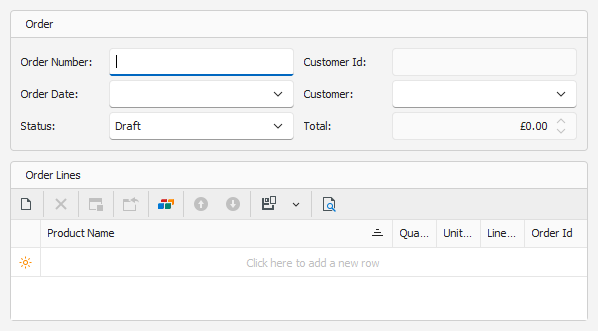
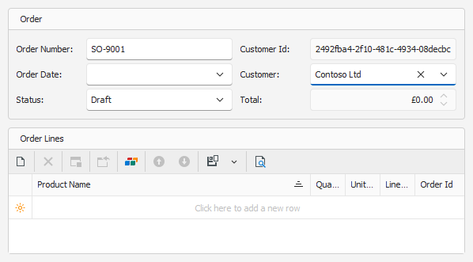
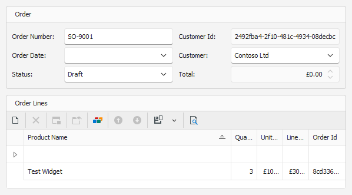
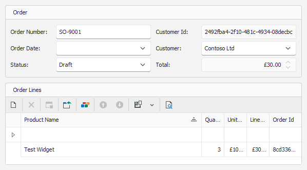

# Creating an Order with Lines (Desktop)
_Draft — generated from a live Blazor run on 2026-06-16. Review and edit._

This walkthrough uses the **Windows desktop** app. An order groups one or more line items.

### Open the **Orders** list and click **New**.

### Enter the **Order Number** and pick the **Customer**.

### Click **Save** to create the order, then add a line in the **Order Lines** grid.

### Click **Save** again. The order and its line are stored together.

