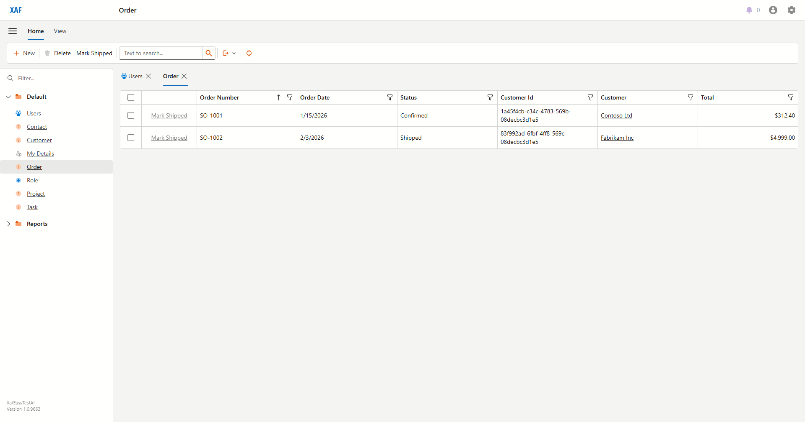
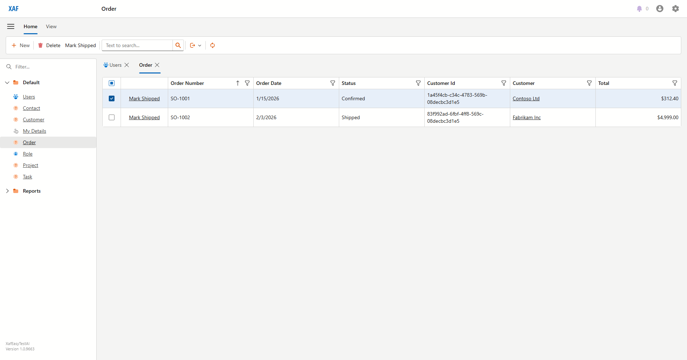
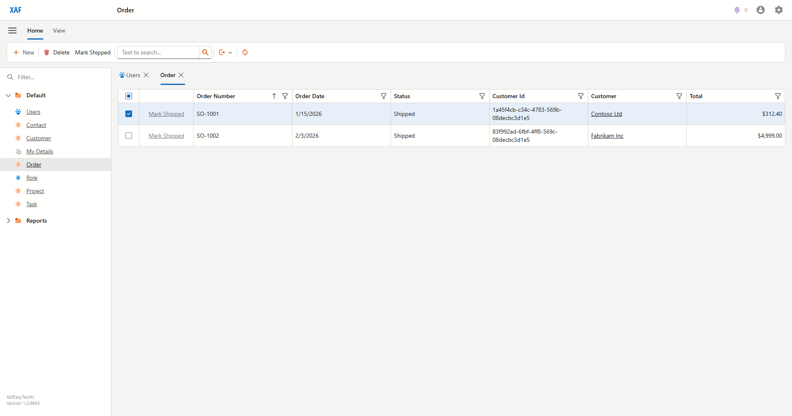

# Shipping Orders
_Draft — generated from a live Blazor run on 2026-06-16. Review and edit._

When an order is ready to leave, mark it shipped from the Orders list.

### Open the **Orders** list.

### Select the order you want to ship (here, **SO-1001**).

### Click **Mark Shipped**. The order's **Status** changes to *Shipped*.

