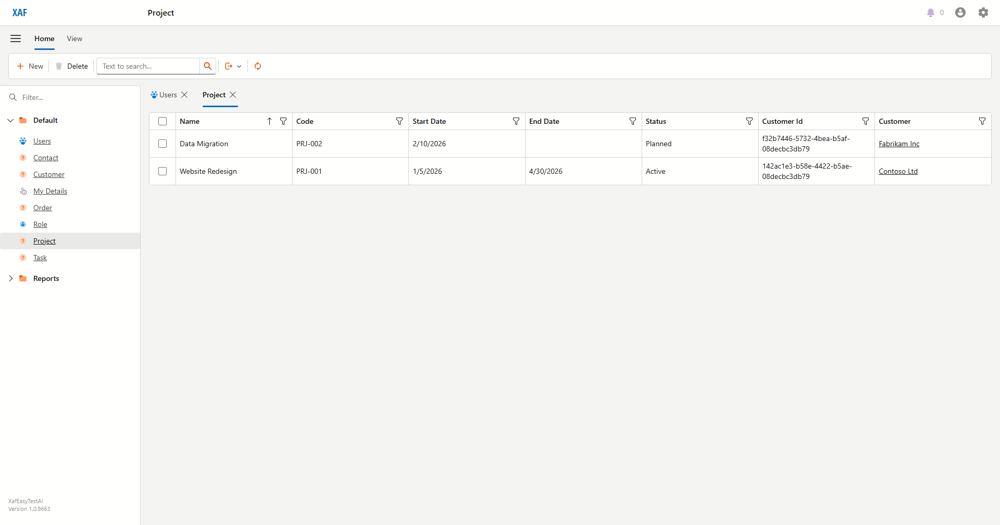
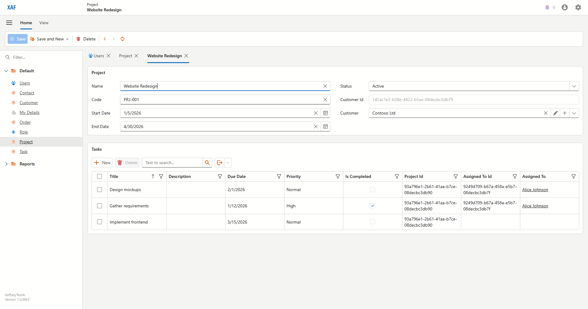
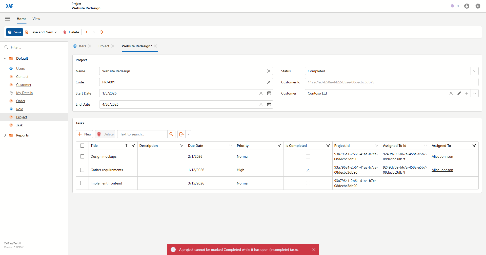

# Completing Projects
_Draft — generated from a live Blazor run on 2026-06-16. Review and edit._

A project can only be marked **Completed** once all of its tasks are done.

### Open the **Projects** list.

### Open **Website Redesign**, which still has open tasks.

### Set **Status** to *Completed* and click **Save** — the app blocks it and explains why.

